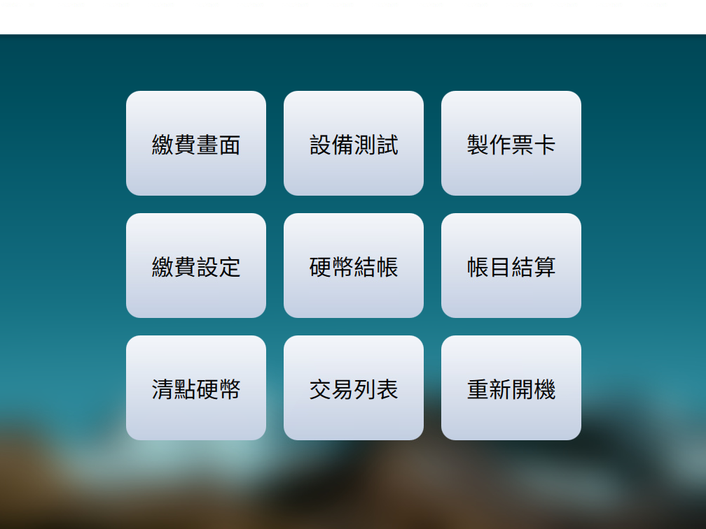

# 成功進入後台

後台管理介面會有 9 個主要的功能

* 
  繳費畫面 ： 重新回到待機畫面等待停車票卡投入

* 設備測試 ： 測試各個部件的連線狀態
* 製作票卡 ： 製作「**VIP**」票卡及「**管理權限**」票卡
* 繳費設定 ： 調整發票抬頭相關設定
* 硬幣結帳 ： 退幣、退鈔票、人工補幣
* 帳目結算 ： 結算前一次結帳後至當下時間之臨停交易帳目
* 清點硬幣 ： 清算收費機內之硬幣數量是否與系統數據相符
* 交易列表 ： 查看臨時停車交易紀錄
* 重新開機 

